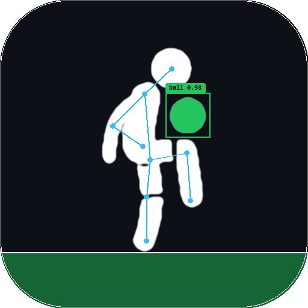
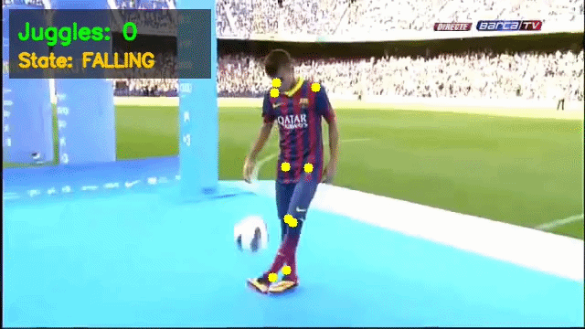
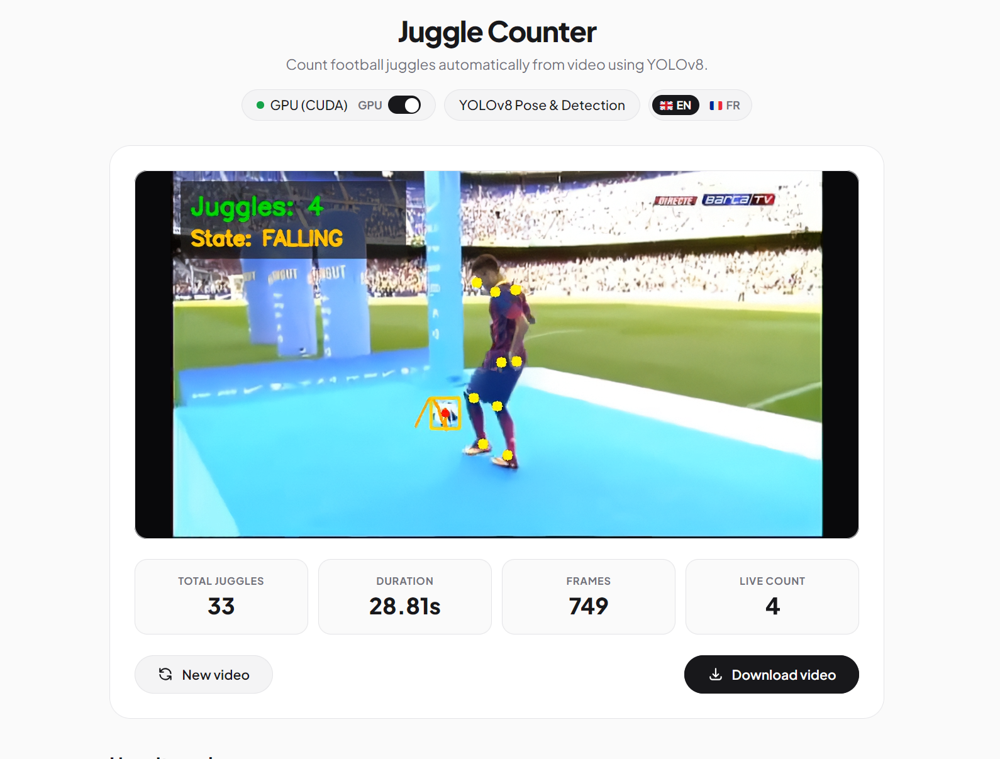

<div align="center">

# Juggle Count



A small computer vision side project experimenting with YOLOv8 to automatically track and count football juggles from uploaded videos.

  <p>
    <a href="#quick-start">Quick Start</a> •
    <a href="#features">Features</a> •
    <a href="#development">Development</a>
  </p>
</div>



---

## Quick Start

### 1. Prerequisites

Make sure you have [uv](https://docs.astral.sh/uv/) installed.

### 2. Run the development server

```bash
uv run dev # will automatically install dependencies and start the server
```

### 3. Open the application

Open your browser at [http://localhost:8080](http://localhost:8080).

---

## Features

The app is a simple web interface that allows you to upload a video and get an annotated version with the juggle count and trajectory overlays.



- Ball tracking and full-body pose estimation using YOLOv8.
- Trajectory analysis and contact heuristics to count valid juggles.
- Background task processing with live progress bar (GPU & CPU support).
- Video playback, annotated downloads, demo samples, and bilingual support (EN / FR).

---

## Development

This project uses [Ruff](https://docs.astral.sh/ruff/) for code linting and formatting :

```bash
uv run ruff check
uv run ruff format
```

---

<div align="center">
  <i>Made by a football enthusiast who cannot juggle himself</i>
</div>
